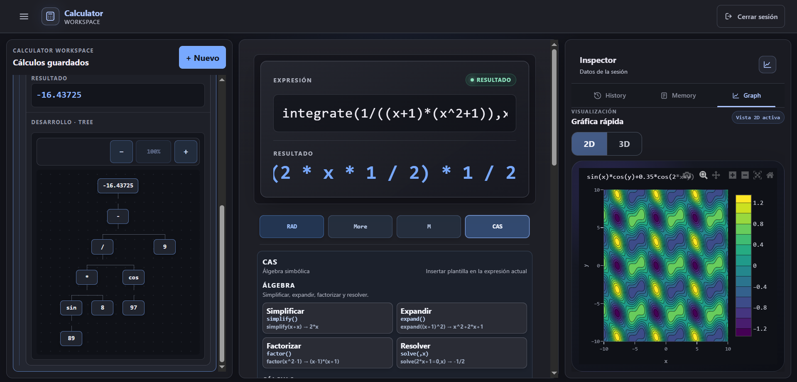
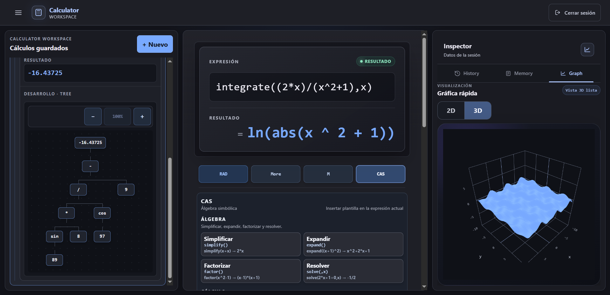
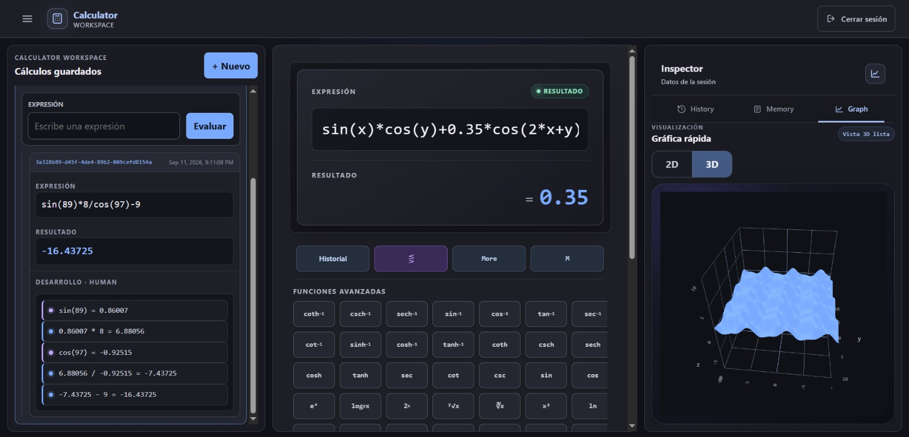
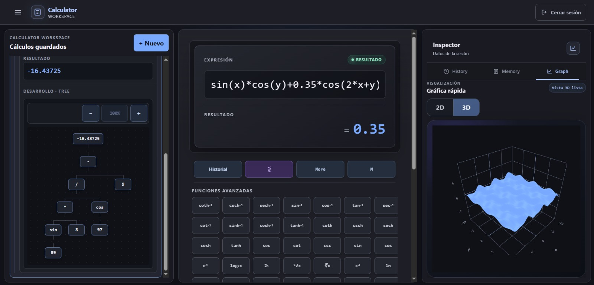
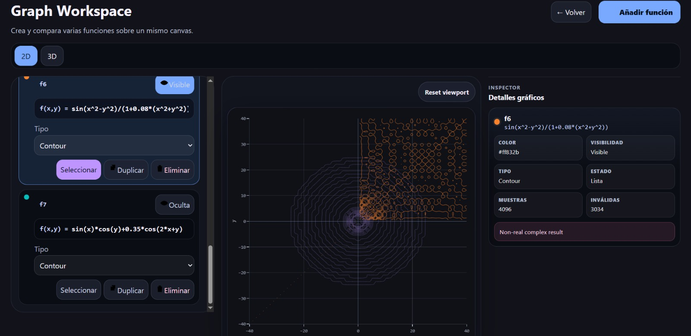

# Calculator

Calculator is a full-stack mathematical workspace with basic, scientific, and graphic calculators, a controlled computer algebra system (CAS), interactive 2D/3D plotting, and persistent calculation workspaces. The client is built with Angular and the authenticated workspace API is provided by Spring Boot.

[](https://github.com/JVenturaDev/Calculator/tree/v0.1.0)
[](https://angular.dev/)
[](https://www.typescriptlang.org/)
[](LICENSE)

## Live Demo

Try the frontend at [jventuradev.github.io/Calculator](https://jventuradev.github.io/Calculator/).

The GitHub Pages deployment supports an offline guest session and browser-backed features. Real login, registration, and authenticated workspace persistence require the backend and are not part of the static Pages deployment.


<p align="center"><em>Full Graph Workspace with function management, interactive 3D visualization, and inspection.</em></p>

## Features

- Basic, scientific, and graphic calculator modes with keyboard input.
- Tokenization, postfix conversion, and RPN-based numeric evaluation.
- Complex-number calculations and RAD, GRAD, and DEG angle modes.
- Restorable calculation history and MC/MR/M+/M- memory operations.
- A controlled CAS for exact and symbolic workflows.
- Quick 2D/3D plots and an independent, persistent Graph Workspace.
- Multiple graph functions with visibility, color, selection, hover, legend, zoom, and pan controls.
- Scientific workspaces with expressions, tags, calculations, and rendered steps.
- JWT-based authentication plus a Pages-only offline guest mode.

## Calculator Modes

### Basic

Provides the familiar arithmetic workflow for everyday calculations, including direct keyboard input and reusable history.

### Scientific

Adds trigonometric and advanced operations, angle modes, memory controls, CAS quick actions, and structured calculation views.

### Graphic

Combines calculator input with fast plotting. Expressions in `x` can be rendered as 2D lines; supported expressions in `x` and `y` can be viewed as 2D contours or 3D surfaces.

## Computer Algebra System

Calculator includes a purpose-built CAS with deliberately controlled scope. It supports:

- simplification and canonicalization;
- controlled expansion and factorization;
- symbolic differentiation;
- controlled symbolic integration with exact rational arithmetic;
- controlled equation solving;
- finite and one-sided limits, including supported infinite cases;
- Taylor and Maclaurin series;
- convergence analysis for supported series families;
- typed errors for unsupported operations.

### Symbolic workflow with 2D inspection



<p align="center"><em>Scientific Calculator with a symbolic command and result, calculation tree, CAS actions, and quick 2D inspection.</em></p>

### Symbolic workflow with 3D inspection



<p align="center"><em>Scientific Calculator with symbolic integration, structured steps, CAS actions, and a quick 3D surface.</em></p>

This is not a general-purpose CAS. Unsupported symbolic families fail explicitly rather than falling back to an approximate or invented result.

## Calculation Steps

Calculator can present the same calculation process as a readable sequence of operations or as a structural expression tree.

### Human View



<p align="center"><em>The complete scientific workspace with sequential Human View steps and quick 3D inspection.</em></p>

### Tree View



<p align="center"><em>The same workspace centered on structural Tree View steps and their expression hierarchy.</em></p>

## Graphing and Workspaces

The quick plot in the calculator Inspector provides transient 2D and 3D visualization. The separate Graph Workspace supports multiple simultaneous functions, persistent state, and a larger interactive canvas.

- `line`: 2D plots for supported single-variable expressions.
- `contour`: 2D contour plots for supported `f(x, y)` expressions.
- 3D view: renders compatible contour functions as surfaces `z = f(x, y)`.
- Persistent functions, selection, 2D viewport, 3D camera, and scene ranges.



<p align="center"><em>Full Graph Workspace in 2D with multiple contour functions, selection controls, and detailed inspection.</em></p>

Implicit 3D equations, parametric surfaces, and general 3D line rendering are not currently supported.

## Persistence and Sessions

| Area | Storage |
| --- | --- |
| Calculation history | `localStorage` |
| Calculator memory | IndexedDB |
| Graph Workspace | Versioned `localStorage` snapshot |
| Offline demo workspace | `sessionStorage` |
| Authenticated scientific workspace | Spring Boot `/api/workspace` API |
| Real authentication | Backend-issued JWT stored by the frontend |

Offline demo data remains isolated from authenticated backend data.

## Tech Stack

| Layer | Technologies |
| --- | --- |
| Frontend | Angular 20.3.x, TypeScript 5.8, RxJS 7.8, Plotly 3.1.2, Complex.js 2.4.2 |
| Frontend tests | Karma 6.4, Jasmine 5.9 |
| Backend | Java 21, Spring Boot 3.3.4, Spring Web, Spring Security, Spring Data JPA |
| Auth and data | JJWT 0.11.5, PostgreSQL |
| Tooling and deployment | Maven Wrapper, Docker, Docker Compose, Nginx, GitHub Actions, GitHub Pages |

The GL3D Plotly bundle is loaded lazily so 3D support does not become part of the initial frontend bundle.

## Project Structure

```text
Calculator/
|-- .github/workflows/   # GitHub Pages deployment workflow
|-- front-end/           # Angular application, browser persistence, tests, and UI
|-- back-end/            # Spring Boot authentication and workspace API
|-- nginx/               # Reverse-proxy and certificate configuration
|-- docker-compose.yml   # Multi-container development/deployment definition
`-- init-letsencrypt.sh  # Certificate bootstrap helper
```

For frontend-specific architecture and commands, see [front-end/README.md](front-end/README.md).

## Getting Started

### Prerequisites

- Node.js 20 or a compatible current LTS release and npm.
- Java 21.
- PostgreSQL.

### Backend

Configure the datasource properties shown in `back-end/src/main/resources/application-example.properties` and provide `security.jwt.secret` in your local Spring configuration. Then start the API on port `8080`:

```powershell
cd back-end
.\mvnw.cmd spring-boot:run
```

On macOS or Linux, use `./mvnw spring-boot:run`.

### Frontend

In another terminal:

```powershell
cd front-end
npm install
npm start
```

Open [http://localhost:4200](http://localhost:4200). Angular's development proxy forwards relative `/auth` and `/api` requests to `http://localhost:8080`, so the backend must be running for real authentication and authenticated workspaces.

## Testing and Build

From `front-end/`:

```powershell
npm test -- --progress=false --watch=false
npx ngc -p tsconfig.app.json
npx tsc --noEmit -p tsconfig.app.json
npx tsc --noEmit -p tsconfig.spec.json
npm run build
```

Release `v0.1.0` was stabilized with the full Karma suite, Angular compiler checks, TypeScript checks, and the production build passing in the maintainer's environment.

## Docker and Deployment

The repository includes Dockerfiles, Docker Compose, Nginx configuration, and a GitHub Actions workflow for the static GitHub Pages frontend. Treat the current Docker/Nginx setup as infrastructure pending dedicated deployment validation rather than a turnkey production configuration.

## Current Limitations

- The CAS intentionally supports selected symbolic families rather than unrestricted symbolic mathematics.
- Advanced 3D families such as implicit equations and parametric surfaces are outside the current scope.
- Docker/Nginx deployment needs dedicated validation, including the `/api` proxy path and the `workspace-postgres` versus `db` Compose hostname discrepancy.
- GitHub Pages provides only the supported offline guest experience; backend-backed features require a running API.

## Release

Current release: [v0.1.0](https://github.com/JVenturaDev/Calculator/tree/v0.1.0). See [CHANGELOG.md](CHANGELOG.md) for the release summary.

## Roadmap

- Harden and validate the containerized deployment.
- Add complete public CI validation.
- Continue documentation cleanup.
- Refine responsive behavior and interaction details.
- Extend the CAS through controlled, regression-tested families.

## License

Calculator is licensed under GNU GPL version 3 or any later version. See [LICENSE](LICENSE).
